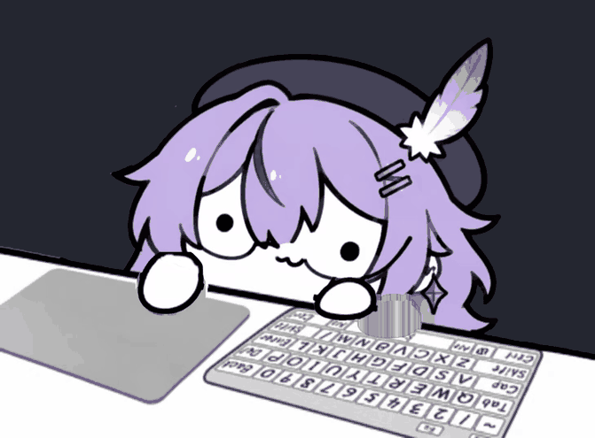
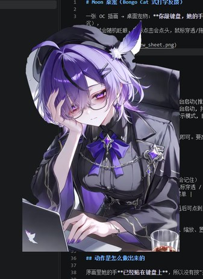

# Moon 桌宠（Bongo Cat 式打字反馈）

**当前版本 v2.0.1**（Bongo Cat 版） · [更新日志](CHANGELOG.md) · [下载](https://github.com/shamate-tv/desk_pet_for_Moon_/releases)（取 Releases 里的 `MoonPet-v2.0.1.exe`）

一张 OC 插画 → Bongo Cat 式桌宠：**你敲键盘，她就躲在桌子后面左右爪交替拍桌子**，
整个人跟着往下一沉；空闲时随机眨眼，鼠标点击双爪同砸，鼠标穿透/拖动/托盘菜单齐全。



*静态分帧见 `preview/typing.jpg`（含眨眼那帧），五个状态并排见 `preview/states.jpg`，
爪子下砸时的补洞检查见 `preview/paw-dive.jpg`，睁眼/闭眼对比见 `preview/blink.png`*

真实桌面上的样子（透明背景，直接压在编辑器上）：



---

## 快速开始

```bat
pip install -r requirements.txt
run.bat                 :: 无控制台启动(推荐)
run_debug.bat           :: 带控制台启动, 排错用
python pet\main.py --demo   :: 演示模式, 自动模拟打字(不用真的敲)
```

素材已在 `assets/` 里生成好，直接跑即可。要改图/换图再往下看「素材流水线」。

## 操作

| 操作 | 效果 |
|---|---|
| 拖动 | 左键拖到屏幕任意位置（位置会记住） |
| 右键 | 菜单：大小 / 始终置顶 / 鼠标穿透 / 回到右下角 / 退出 |
| 托盘图标 | 单击显示-隐藏，右键同菜单 |
| 全局鼠标点击 | 她轻微点头 |
| `Ctrl+Alt+P` | 鼠标穿透开关（穿透后可点到底下的窗口） |
| `Ctrl+Alt+H` | 显示 / 隐藏 |

配置存在根目录 `config.json`（位置、缩放、置顶）。

---

## 动作是怎么做出来的

原画是 Bongo Cat 的标准构图：**角色躲在桌子后面，只露出头和两只白手套爪**，前面是键盘与鼠标垫。
所以动画是经典的两件事：

- **爪子悬空 + 砸下**：打字时两只爪子**抬离桌面约 30px 悬着**，敲键时右爪砸向那个键、点击时左爪砸下，
  砸到桌面的瞬间纵向压扁 16%、横向撑开 8%；停手 1.5 秒后爪子落回桌面。
- **右手敲键盘**：每敲一个键，**右爪**滑到键盘上那个键的位置再砸下去
  （键位表 `KEY_LAYOUT`，坐标由 `KEY_ORIGIN/KEY_R/KEY_C` 定义的键盘网格算出）。
- **左手扶鼠标**：**左爪**在鼠标垫上跟着鼠标在屏幕上的位置滑动；
  鼠标点击时左爪按下去（`MOUSE_DX/MOUSE_DY` 控制跟随范围）。
- **整个人跟着一沉**：把整幅图**以底边为锚纵向压缩 2%**——
  锚点在底部，所以桌子几乎不动、头肩明显下沉，这就是 Bongo Cat 的弹跳感。
  这个做法不需要把身体和桌子切成两层，也就**没有任何补洞**。
- **眨眼**：直接用原画的线宽把眼睛画成两条短线（`eyes_closed.png`），
  45ms 闭 / 40ms 停 / 75ms 睁，随机 2.6~6.5s 一次，打字越快眨得越频。
- 手部/爪部都是**预渲染**好的小图，运行时只做贴图与缩放，CPU 占用极低。

> 爪子只做**向下**砸，不做抬爪：向下只会多盖住；抬起来会露出键盘按键那种补不出来的细节。
> 爪子周围全是交错的粗描边，inpaint / 最近邻填充都会糊成灰带，最后用的是
> "逐列向上跳过描边、取第一块平涂色再往下抹"——因为只有下砸让开的那几像素会被看到。

## 文件结构

```
art/                      素材源
  OC.psd                  母版(PSD, 6 个图层) —— 改图只动它
  人物.png 左手.png 右手.png 桌子.png 键盘.png 鼠标垫.png    导出的图层
  BongoCatOC.jpg / 抠图.png   AI 原图 / 去背版
skins/                    皮肤(一套素材 = 一个皮肤, 可运行时切换)
  moon/                   原始 OC 皮肤
    skin.json             皮肤配置(名称/缩放/抬爪高度/是否跟随鼠标/是否按键…)
    bg.png                场景板 = 桌子+键盘+鼠标垫+人物
    paw_l.png / paw_r.png 左手 / 右手可动层
    eyes_closed.png       闭眼补丁
    keys.json             50 个键位的坐标
  _template/              新皮肤模板(带 _ 前缀, 不出现在菜单里, 复制它改名就能开工)
pet/
  main.py                 桌宠主程序
pet.ico                   exe / 托盘图标
tools/
  bongo_bg.py             art/ 六图层 -> assets/bg.png + 两只手
  bongo_keys.py           键帽检测 + 单应拟合 -> assets/keys.json
  optimize_assets.py      PNG 无损瘦身(去 PS 元数据)
  make_version_file.py    读 VERSION 生成 exe 版本资源
  make_preview.py         从 build/ 导出 README 用的 preview/ 图
  preview_bongo.py        离线渲染动图
  build_exe.bat           一键打包 exe
  bongo_cut.py            备用: 从整图自动切图层(手工分层不好时用)
lab/live2d/               已结案的 Live2D 可行性验证(代码 + 数据 + 结论)
preview/                  仓库用预览图(README 引用这些)
release/                  打包好的 exe + 读我.txt
build/                    中间产物 + 验收图(.gitignore 忽略)
```

> `art/*.png` 从 PS 导出时带了几 MB 的 XMP 编辑历史, 对渲染毫无用处。
> 跑 `python tools\optimize_assets.py` 可**无损**去掉(逐像素校验), 42MB → 1.2MB。

## 皮肤系统

一套素材就是一个皮肤，运行时能在托盘里切换：

```
skins/<皮肤名>/
  skin.json          必须 —— 配置
  bg.png             必须 —— 场景板(不含爪子)
  paw_l.png          必须 —— 左爪(原图同尺寸, 位置对齐)
  paw_r.png          必须 —— 右爪
  eyes_closed.png    可选 —— 闭眼补丁(不画就不眨眼)
  keys.json          可选 —— 键位表(不给就只原地砸, 不按对应键)
```

`skin.json` 常用字段（全部可省，只写想改的）：

| 字段 | 默认 | 说明 |
|---|---|---|
| `name` / `desc` | 目录名 | 菜单和文档里显示的名字 |
| `scale` | 0.42 | 默认缩放，0.5 = 原图一半 |
| `lift` | 30.0 | 打字时爪子抬起多少像素（原图单位） |
| `hover_keep` | 1.5 | 停手多少秒后爪子落回桌面 |
| `follow_mouse` | true | 左爪是否在垫子上跟着鼠标滑 |
| `press_keys` | true | 右爪是否滑到对应键位（需要 `keys.json`） |
| `mouse_dx` / `mouse_dy` | — | 跟随鼠标的活动范围（相对原位） |
| `paw_boxes` | 自动 | 两只爪子的裁剪框；**不写就按 alpha 包围盒自动算**（含余量） |
| `eye_box` | 自动 | 闭眼补丁裁剪区；不写就按 `eyes_closed.png` 的 alpha 包围盒 |

**加一个新皮肤**：复制 `skins/_template/` 改名（别用 `_` 开头，那会被菜单忽略）→ 放素材 → 改 `skin.json`。
命令行也可以直接指定：`python pet\main.py --skin bongo`

## 素材流水线

```bat
python toolsongo_bg.py       :: art/ 六图层 -> assets/bg.png(场景板) + paw_l/paw_r.png
python toolsongo_keys.py     :: 键帽检测 + 单应拟合 -> assets/keys.json(50 个键位)
python toolsongo_cut.py      :: (备用)从整图自动切图层
python tools\preview_bongo.py  :: -> build/preview_bongo.gif + 分帧图
python pet\main.py --selftest build\selftest_bongo.png   :: 离屏渲染各状态
python tools\optimize_assets.py :: PNG 无损瘦身(去 PS 元数据, 逐像素校验)
python tools\make_preview.py   :: 把上面这些导出/压缩成 preview/ 里的 README 用图
toolsuild_exe.bat            :: 重新打包 exe
```


### 键位校准（`--keydebug`）

键位表是从原画的键盘上量出来的，如果换图或觉得对不准，用调试模式肉眼核对：

```bat
python pet\main.py --keydebug
release\MoonPet-v2.0.0.exe --keydebug
```

它会把每个键位画成十字并标上字母，压在键盘上。偏了只改 `tools/bongo_keys.py` 里的
`SHIFT` 一个常量后重跑 `python toolsongo_keys.py`：

```
右 1 键 = (+49.5, +10.5)     左 1 键 = (-49.5, -10.5)
下 1 行 = (  -9,   +45)      上 1 行 = (   +9,   -45)     半个键取一半
```

### 换成你自己的图

1. 把去背后的图放到 `art/`，改 `tools/bongo_cut.py` 顶部的 `SRC`、`PAW_BOX`（两只爪子的包围盒）。
2. 跑 `python toolsongo_cut.py`，看 `build/review_bongo.png`（左=静止 / 右=双爪砸到底）
   和 `build/review_bongo_eyes.png`（睁眼/闭眼）。
3. 描边断裂导致爪子分割不出来时，用 `PAW_POLY` 手描外轮廓；眼睛识别失败时检查 `find_eyes` 的阈值。

## 调参速查（`pet/main.py` 顶部）

| 常量 | 默认 | 作用 |
|---|---|---|
| `LIFT_PX` | 30.0 | 抬爪高度（原图像素）——打字时爪子悬空的高度 |
| `HOVER_KEEP` | 1.5 | 停手多久后爪子落回桌面（秒） |
| `PAW_SQUASH` / `PAW_WIDEN` | 0.16 / 0.08 | 砸下去时的压扁 / 撑开比例 |
| `FOLLOW_K` | 70 | 爪子滑向目标的弹簧刚度（越大跟得越紧） |
| `KEY_ORIGIN/KEY_R/KEY_C` | — | 键盘网格：`1` 键的位置 + 每列 / 每行的位移 |
| `BODY_SQUASH` | 0.020 | 整体下沉幅度（2%）。这是"弹跳感"的主要来源 |
| `K_HIT` / `C_HIT` | 900 / 40 | 爪子弹簧的刚度 / 阻尼，越大越干脆 |
| `IMPULSE` | 9.0 | 每次敲击给爪子的冲量 |
| `BLINK_*` | 0.05/0.04/0.075 | 眨眼三段时间 |

## 打包成 exe

`release\MoonPet-v2.0.0.exe`（单文件，绿色免安装，目标机器不需要 Python）。
双击即用；首次启动要解包到临时目录，约 3~6 秒才出现。

**版本号只有一个来源**：`pet/main.py` 顶部的 `VERSION`。打包脚本会读它，自动写进
exe 的 Windows 属性（右键→属性→详细信息能看到版本号）、并命名成 `MoonPet-v2.0.1.exe`。
发新版时改那一行 + 在 `CHANGELOG.md` 加一段即可。

重新打包：

```bat
pip install pyinstaller
tools\build_exe.bat
```

脚本会先从 `assets/sprite.png` 生成 `pet.ico`，再调 PyInstaller。要点：
`--add-data` 和 `--icon` 的路径**必须写绝对路径**（配 `--specpath` 时相对路径会按 spec 所在目录解析），
程序里也做了兼容：打包后素材从 `sys._MEIPASS\assets` 读，`config.json` 写在 **exe 旁边**（可写）。

> `--onefile` 启动慢、且个别杀毒软件会误报；想要秒开可以改成 `--onedir`（产出一个文件夹，里面放快捷方式）。

## 验收图 / 预览图

`preview/` 是**给仓库和 README 用的**（ASCII 文件名、压过体积，会被 git 跟踪）：

| 文件 | 看什么 |
|---|---|
| `typing.gif` | 打字动图（README 首图）：左右爪交替砸 + 整体下沉 |
| `typing.jpg` | 同一段的 6 帧静图（最后一帧是眨眼） |
| `states.jpg` | 五个状态并排：静息 / 左爪 / 左爪到底 / 右爪 / 双爪+眨眼 |
| `paw-dive.jpg` | 爪子砸到底时的补洞检查（左=静止 右=砸到底） |
| `blink.png` | 睁眼 / 闭眼对比 |
| `desktop.jpg` | 真实桌面实拍 |

`build/` 是**中间产物 + 全部调试图**（`review_*.png`、PyInstaller 工作目录、日志等），
已在 `.gitignore` 里忽略，不进仓库。想更新 `preview/` 就跑：

```bat
python tools\make_preview.py
```

## 已知限制

- **爪子砸下去时，上缘会让开几像素**，那几像素是程序补的（原画没画）。
  补法见上文，正常缩放下看不出来，但把 `DIVE_PX` 调太大就会露馅。
- **只有一张原画**，所以没有"爪子抬起"的姿势；只有下砸、眨眼两种变化。
- 全屏游戏/反作弊程序可能会屏蔽 pynput 的全局钩子，此时打字没反应
  （解决办法是 HID 直读，见下）。

## 下一步可以做什么

1. **HID 直读模式**：绕开全局钩子，`hid` 库直接读键盘原始报文，全屏游戏里也能触发（Bongo Cat Mver 同款思路）；
2. **音效**：砸下去时叠一个很轻的"啪"，音量跟随打字速度 —— Bongo Cat 的另一个灵魂；
3. **多个姿势**：再生成几张"爪子抬起 / 张嘴 / 生气"的原画，扩展成状态机；
4. **连击计数 / 打字速度显示**：打字越快砸得越狠。
